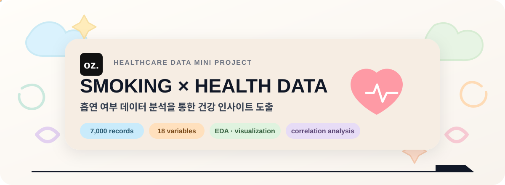
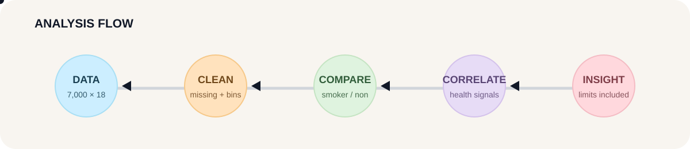
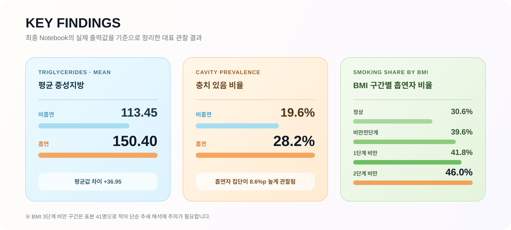

  

  <strong>OZ Coding School · AI Healthcare Mini Project · Team 11</strong> 
  교육용 건강검진 프로젝트 데이터 기반 흡연 여부별 건강 지표 분석·시각화

---

## 프로젝트

[`smoking_health_data`](https://github.com/oz-dongari/smoking_health_data)  
**7,000건 · 18개 컬럼**  
BMI · 중성지방 · 충치 · 데이터셋 혈압 변수 중심 전처리 · EDA · 집단 비교 · 상관관계 분석

**분석 초점:** 예측 성능 경쟁보다 관찰 패턴의 구조화·해석

  

## 핵심 결과

  

| 항목 | 비흡연 | 흡연 |
|---|---:|---:|
| 중성지방 평균 | 113.45 | **150.40** |
| 충치 있음 | 19.6% | **28.2%** |
| BMI 평균 | 23.81 | **24.73** |
| 데이터셋 혈압 변수 평균* | 45.42 | 45.76 |

**BMI 구간별 흡연자 비율**  
정상 `30.6%` → 비만전단계 `39.6%` → 1단계 비만 `41.8%` → 2단계 비만 `46.0%`  
3단계 비만 `43.9%` (`n=41`) — 소표본으로 추세 해석 제외

**Pearson r**  
중성지방 `0.25` · BMI `0.13` · 충치 `0.10` · 데이터셋 혈압 변수 `0.02`

\* `혈압`은 일반적인 임상 혈압(mmHg)로 직접 대응한다고 확인되지 않은 제공 변수입니다.

세부 전처리·시각화: [`smoking_health_data`](https://github.com/oz-dongari/smoking_health_data)

## 해석 범위

교육용 관찰 데이터의 기술통계·집단 차이·상관관계에 한정하며 인과 추론과 임상적 일반화를 제외합니다.

**주요 한계:** 혈압 변수의 임상적 정의 미확인 · 성별 정보 부재 · 흡연 여부/연령대 표본 불균형 · 생활 습관 변수 부재 · 모집단 대표성 미확인

데이터 출처·공개 경계: [`smoking_health_data/docs/DATA_SCOPE_AND_PUBLIC_BOUNDARY.md`](https://github.com/oz-dongari/smoking_health_data/blob/main/docs/DATA_SCOPE_AND_PUBLIC_BOUNDARY.md)

## Repository

### [`smoking_health_data`](https://github.com/oz-dongari/smoking_health_data)

전처리 · EDA · 흡연 여부별 비교 · 상관관계 · 주요 시각화  
현재 default branch에 원본 건강검진 데이터 파일·row-level preview 미게시

## Team

**김진형 · 남한솔 · 안상균 · 이희진**  
OZ Coding School · 11조 헬스 케어 동아리

**Contribution boundary:** 공개 Git history는 저장소 업로드·문서 정리 이력을 주로 반영하며, commit 수를 프로젝트 분석 기여도 순위로 해석하지 않습니다.  
세부 기준: [Project Team / Contribution Record](https://github.com/oz-dongari/smoking_health_data/blob/main/CONTRIBUTORS.md)

  Smoking & Health Data Analysis · AI Healthcare Mini Project

